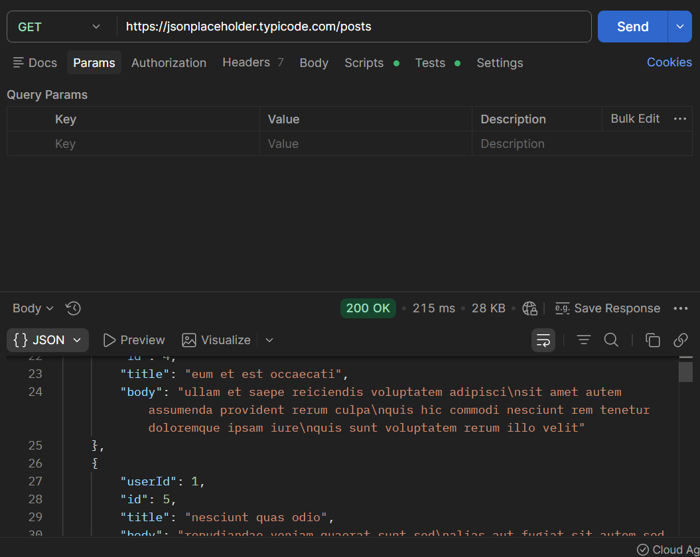

# API Testing – Postman

## Description
Performed basic API testing using Postman to validate GET requests and responses.

## Tested Endpoints
- GET https://jsonplaceholder.typicode.com/posts
- GET https://jsonplaceholder.typicode.com/users

## Validations
- Status code is 200 OK
- Response is received in JSON format
- Response contains a list of objects
- Each object contains expected fields (id, userId, title, body)

## Result
All tests passed successfully. API returned valid and structured data.

## Evidence

